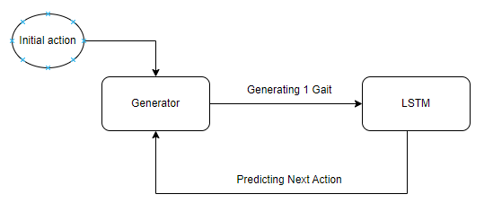

## 1- Data Exploration

You can find the data exploration in the Data Exploration Jupyter Notebook, in conclusion the dataset is imbalanced and the distribution of the actions are very close to each other which makes it harder while training

## 2- Approaches to re-create

It can be recreated using:
- Generative Adversarial Networks and its variants (Conditional GAN, Time GAN)
- Variational Autoencoders
- Recurrent Neural Networks and LSTM
- Diffusion models

## 3- Reacted game

You can find the JSON file that contains a game I recreated using my approach

## 4- Used Approach

For my approach I used Conditional GAN and LSTM models together. I tried several methods but that was the best result I could reached.

### General Flow

I started with an initial action, that will be given to the generator, the generator will pick a random number from the chosen action mean time normal distribution. Then the generator generate one norm and will append it to a list until the chosen time is over. Now we have 1 gait ready. 

This gait will be given to the LSTM model that will predict the next action. We keep on creating like that until the game time is over.



### Why?

Since the data analysis showed that it is imbalanced and the distribution is similar between  all the actions, it was hard to use the gait list without exploding it. 

Also since the norm distribution isn't changing over time, then generating a gait at the start or at the end of the game won't be different.

That is why for the Conditional GAN, I exploded the dataset, then each captured norm at 50hz is now labeled. Then I trained my GAN and reach a good result. We can see the loss figure in the GAN file shows that the generator converged.

The post and pre proccessing data for the GAN can be found in the Conditional GAN Jupyter Notebook

Once the GAN was trained, I generated my own gait steps using the GAN, so I created my own list of actions and generated the norms from the GAN. Then I appended these data to match_1.json to make it more balanced.

Now I still need to predict what is the next step. So I used simple LSTM where I made some feature engineering and created new features from the new balanced dataset to predict the next step, but unfortunately the result wasn't the best and it was overfitting.

This why I chose this approach because I thought that since the dataset is imbalanced I should balance it somehow before using it with an LSTM model or else it will keep predicting 'walk'. So I created the conditional GAN to use it in my approach and in balancing the dataset.

Another drawback of this approach is that the generation is slow, it takes much time to build the whole match, since the generator is generating norm by norm then I do the necessary preprossing to predict the next label.

## 5- Running the code

Requirements:
- Docker

Then clone the repository, and do the following commands:
```
cd generative_ai/generation
docker build -t game-generator .
docker run -v $(pwd):/app game-generator python generate.py --games 2 --time 2 1
```

Once done the match json file will be auto generated in the same directory

Keep in mind that the generation takes time, a 10mins match game will take around 10mins to be generated

Concerning the arguments for the python script, the game time are consecutive so here game 1 with 2min and game 2 with 1min.

## 6- Additional Info

In the repository you will find a json file 'balanced_dataset.json' is the one I trained the LSTM on, I generated this dataset with the help of the Conditional GAN

And in the generation folder you will find 'generated_10.json' file, this is a game I generated using the whole approach
